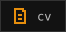
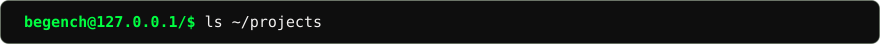
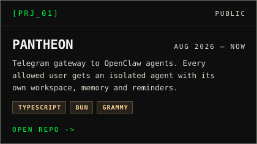
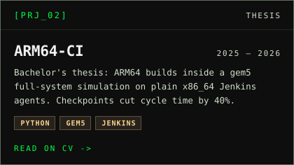
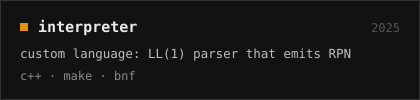
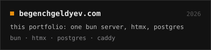

  
    
  &nbsp;
  &nbsp;
  &nbsp;
  

 

  
  
  
  

 

<picture>
  <source media="(prefers-color-scheme: dark)" srcset="https://raw.githubusercontent.com/begenchgeldyev/begenchgeldyev/output/snake-dark.svg">
  <source media="(prefers-color-scheme: light)" srcset="https://raw.githubusercontent.com/begenchgeldyev/begenchgeldyev/output/snake-light.svg">
  
</picture>
