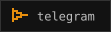

  
    
  &nbsp;
  &nbsp;
  

 

### <samp>$ ls ~/projects</samp>

**[<samp>pantheon/</samp>](https://github.com/begenchgeldyev/pantheon)** &nbsp;`TypeScript` `Bun` `grammY` 
Telegram gateway to OpenClaw: every allowed user gets their own isolated agent, with its own workspace, memory and reminders.

**[<samp>arm64-ci/</samp>](https://begenchgeldyev.com/cv)** &nbsp;`Python` `gem5` `Jenkins` 
My bachelor's thesis. Runs ARM64 builds inside a gem5 full-system simulation on ordinary x86_64 Jenkins agents; restoring checkpoints instead of cold-booting cut cycle time by 40%.

**[<samp>interpreter/</samp>](https://github.com/begenchgeldyev/interpreter)** &nbsp;`C++` `LL(1)` `RPN` 
A small language defined by its own context-free grammar, with a table-driven LL(1) parser that emits RPN in the same pass.
